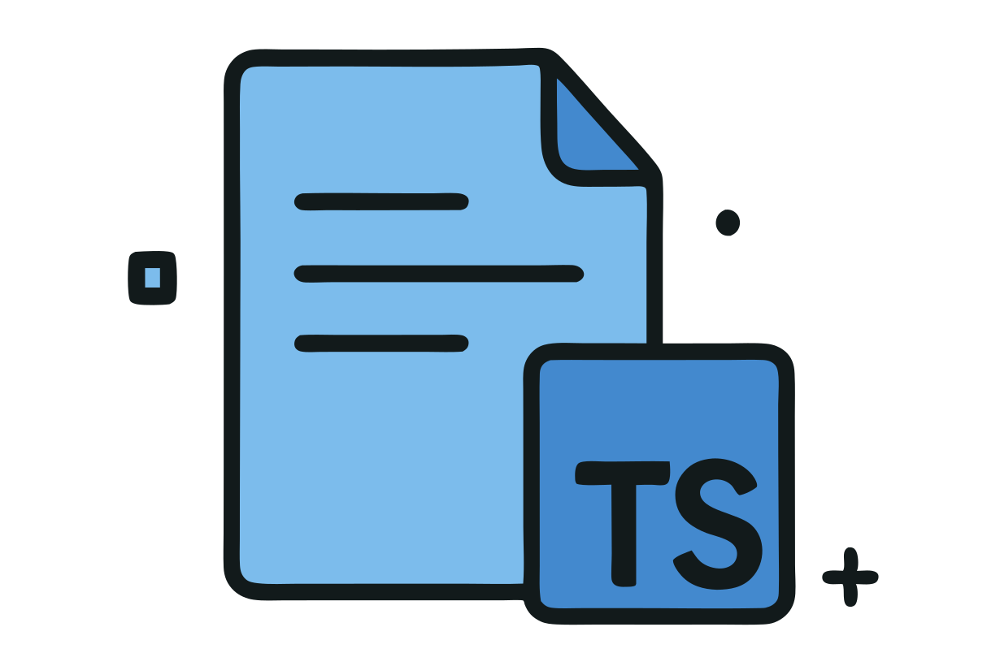

<!-- eslint-disable markdown/no-multiple-h1 -->
<!-- eslint-disable markdown/no-unused-definitions -->
<div align="center">

<h1>Starter TS</h1>

<h3>I love TypeScript!</h3>


</div>

# starter-ts 

[![npm version][npm-version-src]][npm-version-href]
[![npm downloads][npm-downloads-src]][npm-downloads-href]
[![Codecov][codecov-src]][codecov-href]
[![Bundlejs][bundlejs-src]][bundlejs-href]
[![TypeDoc][TypeDoc-src]][TypeDoc-href]

* [starter-ts ](#starter-ts-)
  * [Notes (remove this section when you use the template)](#notes-remove-this-section-when-you-use-the-template)
    * [\* Do a global replace for `starter-ts` and `NamesMT`](#-do-a-global-replace-for-starter-ts-and-namesmt)
    * [\* Notable behaviors:](#-notable-behaviors)
  * [Overview](#overview)
  * [Features](#features)
  * [Usage](#usage)
    * [Install package](#install-package)
    * [Import and use](#import-and-use)
  * [Releasing](#releasing)
  * [Roadmap](#roadmap)
  * [License](#license)

## Notes (remove this section when you use the template)

### * Do a global replace for `starter-ts` and `NamesMT`

### * Notable behaviors:

- [antfu/eslint-config](https://github.com/antfu/eslint-config)
  - Style error silencing is commented out

## Overview

**starter-ts** is my starter/boilerplate for typescript projects.
This template assumes you are using Linux, or the included Dev Container.

## Features

+ 👌 TypeScript
+ 🧐 ESLint + stylistic formatting rules ([antfu](https://github.com/antfu/eslint-config))
+ 💯 Vitest
+ 📦 [tsdown](https://github.com/rolldown/tsdown)
+ 📚 A few more goodies like:
  + [changelogen](https://github.com/unjs/changelogen) release pipeline, driven by GitHub Actions
    with [npm trusted publishing](https://docs.npmjs.com/generating-provenance-statements)
  + [lint-staged](https://github.com/lint-staged/lint-staged) pre-commit hook

## Usage

### Install package

```sh
# npm
npm install starter-ts

# bun
bun add starter-ts

# pnpm
pnpm install starter-ts
```

### Import and use

```ts
// ESM
import { hello } from 'starter-ts'

hello('world')
```

## Releasing

Releases are version-first and dispatched by hand: one workflow run does the whole release,
so a `git push` on its own never publishes anything.

1. Go to **Actions → Release → Run workflow** and give it the version to ship, e.g. `0.2.0`.
2. [`.github/workflows/release.yml`](.github/workflows/release.yml) verifies the version,
   lints/type-checks/tests, then lets [changelogen](https://github.com/unjs/changelogen) write
   the changelog, bump `package.json`, commit and tag `v<version>`. It pushes that commit and
   tag, creates the GitHub release, and publishes to npm with a short-lived
   [OIDC](https://docs.npmjs.com/generating-provenance-statements) token and `--provenance`.

Tick **dry-run** to do everything up to the commit and stop there — nothing is written back.

Locally, `pnpm run release:check <version>` validates a version against `package.json`, and
`pnpm run release:preview` prints the changelog the next release would get.

One-time setup: publish the package once by hand (npm only offers a trusted publisher for a
package that already exists), then on npmjs.com enable **Settings → Publishing access → Trusted
Publishing** for `namesmt/starter-ts` with the workflow filename `release.yml`.

## Roadmap

- [ ] Become the legendary 10000x developer

## License

[![License][license-src]][license-href]

<!-- Badges -->

[npm-version-src]: https://img.shields.io/npm/v/starter-ts?labelColor=18181B&color=F0DB4F
[npm-version-href]: https://npmjs.com/package/starter-ts
[npm-downloads-src]: https://img.shields.io/npm/dm/starter-ts?labelColor=18181B&color=F0DB4F
[npm-downloads-href]: https://npmjs.com/package/starter-ts
[codecov-src]: https://img.shields.io/codecov/c/gh/namesmt/starter-ts/main?labelColor=18181B&color=F0DB4F
[codecov-href]: https://codecov.io/gh/namesmt/starter-ts
[license-src]: https://img.shields.io/github/license/namesmt/starter-ts.svg?labelColor=18181B&color=F0DB4F
[license-href]: https://github.com/namesmt/starter-ts/blob/main/LICENSE
[bundlejs-src]: https://img.shields.io/bundlejs/size/starter-ts?labelColor=18181B&color=F0DB4F
[bundlejs-href]: https://bundlejs.com/?q=starter-ts
[jsDocs-src]: https://img.shields.io/badge/Check_out-jsDocs.io---?labelColor=18181B&color=F0DB4F
[jsDocs-href]: https://www.jsdocs.io/package/starter-ts
[TypeDoc-src]: https://img.shields.io/badge/Check_out-TypeDoc---?labelColor=18181B&color=F0DB4F
[TypeDoc-href]: https://namesmt.github.io/starter-ts/
